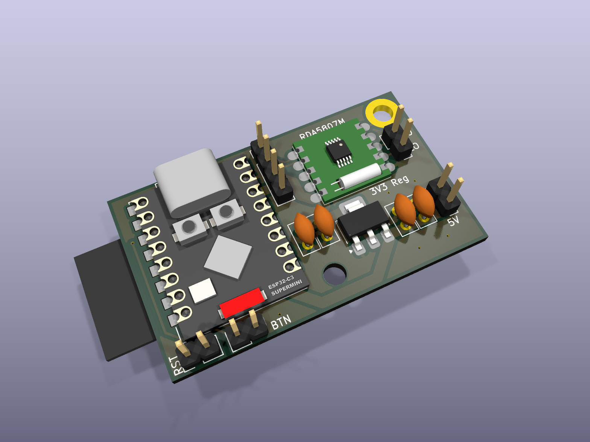
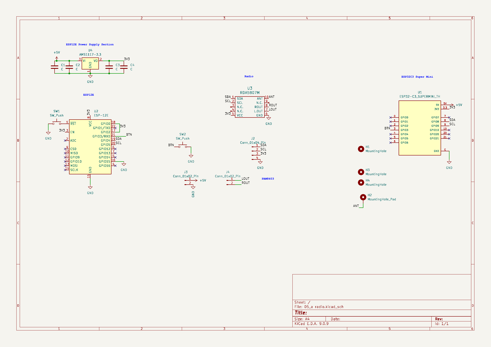
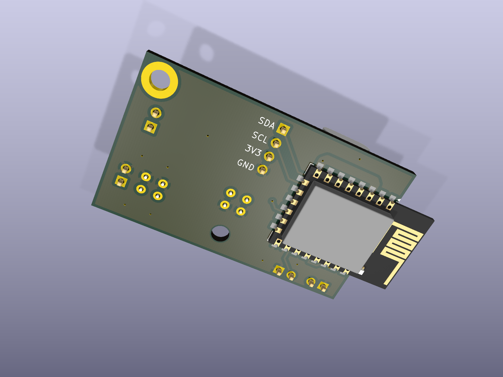
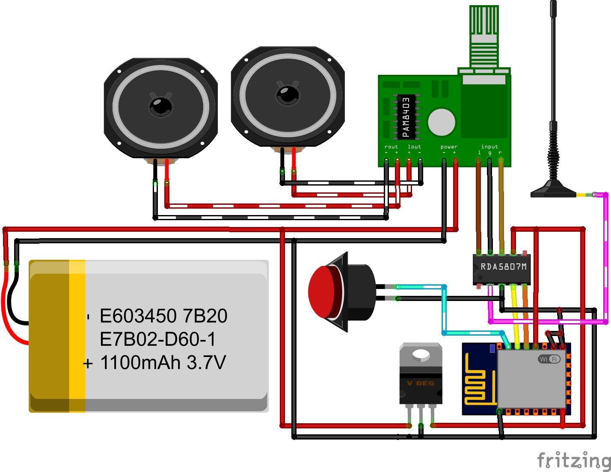
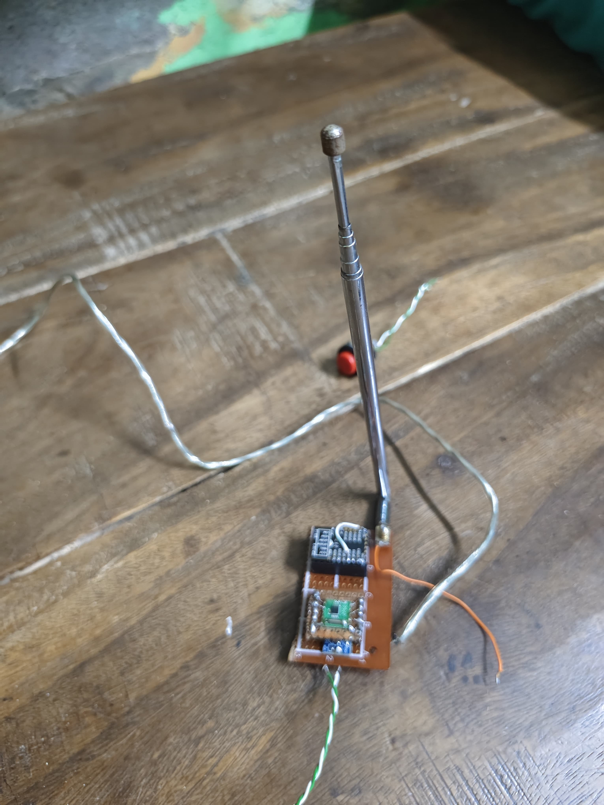

# FM Radio — RDA5807M 📻


## 📋 Overview

A small FM receiver built around the RDA5807M, driven over I2C by either an
ESP32-C3 SuperMini or an ESP-12E — the carrier board has a footprint for both
and the firmware picks its pin map from whichever core you compile for.

Audio leaves the board on a 2-pin header to a PAM8403 amplifier and a speaker;
a telescopic antenna solders to a plated mounting hole. Beyond the original
button-cycles-presets behaviour, the current firmware brings up Wi-Fi and serves
a web UI at `http://radio.local` for presets, volume, seek and manual tuning,
supports OTA reflashing, and optionally drives an SSD1306/SH1106 OLED.



## 🔧 Hardware

The board is a 2-layer 47.4 × 28.2 mm carrier. Reference designators differ
between the schematic and the PCB silkscreen — both are listed below.

| Sch | Silkscreen | Part | Notes |
|-----|-----------|------|-------|
| U1 | `ESP32C3 SuperMini` | ESP32-C3 SuperMini | Top side, through-hole module |
| U2 | `ESP12E` | ESP-12E | **Bottom** side — the alternate MCU, see below |
| U3 | `U3` | RDA5807M module (RRD-102/120 style) | I2C 0x10 (sequential) / 0x11 (indexed) |
| U4 | `3V3 Reg` | AMS1117-3.3, SOT-223 | Only needed for the ESP-12E build |
| C1, C2 | `C1`, `C2` | Ceramic disc, 5 mm THT | AMS1117 input side |
| C3, C4 | `C3`, `C4` | Ceramic disc, 5 mm THT | AMS1117 output side |
| J2 | `GND` | 1×4 header | I2C breakout: SDA, SCL, 3V3, GND — for the OLED |
| J3 | `5V` | 1×2 header | 5 V supply in |
| J4 | `LO` | 1×2 header | Audio out: LOUT, ROUT → PAM8403 |
| SW1 | `RST` | 1×2 header | Reset, broken out for an external button |
| SW2 | `BTN` | 1×2 header | Preset button, broken out for an external button |
| H1 | `H1` | M3 mounting hole | |
| H2 | `H2` | M3 plated mounting hole | Carries the **ANT** net — solder the antenna here |

Notes on the BOM:

- **The capacitor values are not set in the schematic.** C1–C4 are drawn as
  generic `C` with 5 mm disc footprints. Fill them in before ordering; the
  AMS1117 datasheet wants at least 10 µF on the output for stability, which a
  disc ceramic will not give you.
- **SW1/SW2 are drawn as push buttons but laid out as 2-pin headers**, so the
  buttons live off-board. The tactile switches visible on the render are the
  SuperMini module's own boot/reset buttons, not board parts.
- H3 and H4 exist in the schematic but were never placed on the PCB.
- The PAM8403 amplifier, speaker, Li-Ion cell and TP4056 charger are off-board
  and not in this project.

### 📐 Schematic

[](docs/images/schematic.pdf)

*Click for the full-resolution PDF.*

### Board

| Top | Bottom |
|-----|--------|
|  |  |

The KiCad 9 project is in [`hardware/`](hardware/). Both custom 3D models
(`ESP32-C3 supermini v5.step`, `RDA5807m-RRD-120.step`) are committed and
referenced through `${KIPRJMOD}`, so a fresh clone renders identically:

```bash
mkdir -p docs/images

kicad-cli sch export pdf -o docs/images/schematic.pdf "hardware/05_a radio.kicad_sch"
pdftoppm -r 200 -png -singlefile docs/images/schematic.pdf docs/images/schematic

kicad-cli pcb render --side top --quality high --perspective \
  --rotate '-25,0,25' --zoom 0.7 --width 1600 --height 1200 --floor \
  --background opaque -o docs/images/pcb-top.png "hardware/05_a radio.kicad_pcb"

kicad-cli pcb render --side bottom --quality high --perspective \
  --rotate '25,0,25' --zoom 0.52 --width 1600 --height 1200 --floor \
  --background opaque -o docs/images/pcb-bottom.png "hardware/05_a radio.kicad_pcb"
```

Gerbers are **not** committed — the exports under `hardware/Drill/` predated the
current layout, so they are gitignored. Regenerate with
`kicad-cli pcb export gerbers` before ordering.

## ⚡ Wiring

| Signal | ESP32-C3 (U1) | ESP-12E (U2) | Goes to |
|--------|---------------|--------------|---------|
| SDA | GPIO8 | GPIO4 (D2) | RDA5807M + J2 (OLED) |
| SCL | GPIO9 | GPIO5 (D1) | RDA5807M + J2 (OLED) |
| Button | GPIO3 | GPIO3 (RXD) | `BTN` header → GND |
| Reset | — | RST | `RST` header → GND |

These are the same values the firmware compiles in; the pin map lives in
section 2 of the sketch, keyed off `ESP8266` / `ARDUINO_ARCH_ESP32`.

### Three things that will bite you

**Populate one MCU, not both.** The ESP-12E sits on the bottom copper and the
SuperMini on the top, so nothing physically stops you fitting both — but they
share the I2C bus and the 3V3 rail. Pick one.

**Two regulators land on the same 3V3 net.** U1's `3.3` pin and the AMS1117's
output are the same node. With the SuperMini fitted, its onboard LDO already
powers the rail from the 5 V input, so leave `3V3 Reg` (U4) and C3/C4
unpopulated. The AMS1117 is only there for the ESP-12E build.

**GPIO8 and GPIO9 are ESP32-C3 strapping pins.** They are also the I2C bus here.
The chip samples both at reset — GPIO9 low selects download mode, and GPIO8 must
not be low — so the bus pull-ups have to be strong enough that nothing on the
bus drags either line down during boot. If the board only enumerates as a serial
port and never runs, this is the first thing to check.

On the ESP-12E, `pinMode()` on GPIO3 detaches it from UART0 RX: serial *output*
keeps working, serial *input* does not. That is inherited from the original
board and left as-is.

## 🧠 Design notes

**No radio library.** The RDA5807M driver is ~180 lines in section 4 of the
sketch. The chip is simple enough — 16-bit big-endian registers, two I2C
addresses (0x10 auto-incrementing, 0x11 indexed) — that a dependency buys
nothing and costs portability across the two cores.

**One sketch, two targets, no manual switch.** Everything board-specific is
behind `#if defined(ESP8266)` / `#elif defined(ARDUINO_ARCH_ESP32)`: pin map,
network headers, the web server type, and the persistence backend (EEPROM on
the ESP8266, `Preferences` on the ESP32). Selecting the board in the IDE is the
only choice you make.

**The OLED type is a runtime setting, not a compile-time one.** SSD1306 and
SH1106 are indistinguishable over I2C, so the firmware auto-detects that *an*
OLED is present and lets you switch the controller from the web page. Getting
the wrong module in a batch costs a click instead of a reflash. `OLED_ENABLED 0`
compiles the whole display path out.

**Audio survives an OTA update.** The RDA5807M only needs the MCU to change
station — it keeps playing on its own while flash is being rewritten. Both OTA
paths (the Arduino IDE network port and the browser upload at `/update`) are
guarded by `OTA_PASSWORD`, because otherwise anyone on the LAN can replace the
firmware. A failed transfer rolls back to the old image; only a successfully
written but broken sketch means opening the box.

**Credentials are gitignored.** This repo is public, so Wi-Fi and OTA passwords
live in `secrets.h`, which is not tracked. `secrets.h.example` is the template.

### HTTP API

The web page is served from flash at `/` and drives these endpoints:

| Endpoint | Purpose |
|----------|---------|
| `GET /api/status` | Current frequency, volume, stereo/RSSI, preset list |
| `GET /api/preset` | Select a preset slot |
| `GET /api/tune` | Tune to a frequency |
| `GET /api/volume` | Set volume 0–15 |
| `GET /api/seek` | Hardware seek up/down |
| `GET /api/preset/set` | Rewrite a preset slot (persisted) |
| `GET /api/oled` | Switch controller: `ssd1306` / `sh1106` / `none` |
| `GET`/`POST /update` | Browser firmware upload |

## 🔨 Build

```bash
cp Src/test_I2C_Radio/secrets.h.example Src/test_I2C_Radio/secrets.h
$EDITOR Src/test_I2C_Radio/secrets.h

# ESP32-C3 SuperMini
arduino-cli compile --fqbn esp32:esp32:esp32c3 Src/test_I2C_Radio

# ESP-12E
arduino-cli compile --fqbn esp8266:esp8266:nodemcuv2 Src/test_I2C_Radio
```

Requires the `Adafruit SSD1306`, `Adafruit SH110X`, `Adafruit GFX` and
`Adafruit BusIO` libraries unless you set `OLED_ENABLED 0`.

Verified with arduino-cli 1.5.1, esp32 core 3.3.8, esp8266 core 3.1.2:

| Target | Flash | RAM |
|--------|-------|-----|
| ESP32-C3 | 1,130,767 / 1,310,720 B (86%) | 44,252 / 327,680 B (13%) |
| ESP-12E | 340,684 / 1,048,576 B (32%) | 31,864 / 80,192 B (39%) |

Two figures worth watching: the ESP32-C3 build is at **86% of the default
1.3 MB app partition**, and the ESP-12E build sits at **93% of IRAM**
(61,551 / 65,536 B). Neither has much headroom left for new features.

## 🚀 First run

1. Copy `secrets.h.example` → `secrets.h` and fill in your Wi-Fi credentials
   and an OTA password.
2. Flash over USB the first time — OTA needs working firmware to update from.
3. Solder a telescopic antenna to the plated mounting hole H2.
4. Wire the `LO` header to a PAM8403 input and feed 5 V into the `5V` header.
   Take the amplifier's ground from that same header — `LO` carries only LOUT
   and ROUT, no ground of its own.
5. Browse to `http://radio.local`. If mDNS does not resolve, check the serial
   log for the DHCP address.
6. With no Wi-Fi at all the board still works: the `BTN` header cycles presets.

## 📟 Original prototype

The first version of this project was a hand-soldered perfboard build on an
ESP-12E with a fixed volume and 10 hard-coded stations — no Wi-Fi, no display,
one button. The carrier board above replaces it.

| Breadboard wiring | Perfboard build |
|-------------------|-----------------|
|  |  |

## 📜 License

MIT — see [LICENSE](LICENSE).
